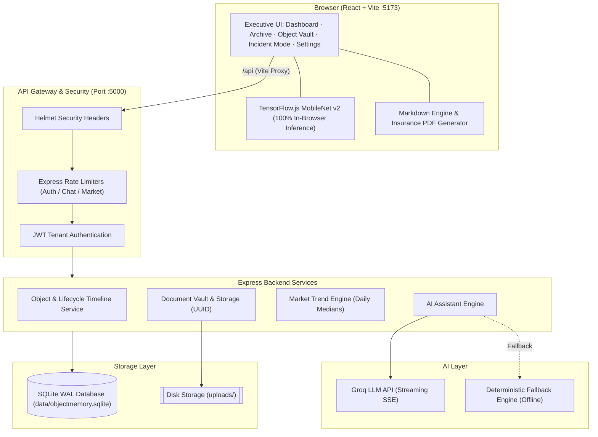

<div align="center">


# ObjectMemory

### Give your possessions a memory.

A production-grade personal vault and archive that tracks the **history, condition, documents, incidents, insurance dossiers, and market value** of everything you own, powered by an on-device vision engine and whole-platform AI intelligence.

<p>
  
  
  
  
  
  
  
  
  
</p>

[Key Features](#-features) ·
[Quick Start](#-quick-start) ·
[Architecture](#-architecture) ·
[Platform Intelligence](#-platform--archive-ai-intelligence) ·
[Insurance Dossiers](#-certified-insurance-claim-dossiers) ·
[Data Portability](#-data-portability--backups) ·
[API Reference](#-api-reference) ·
[Market Tracking](#-market-trend-tracking)

</div>

---

## Why ObjectMemory?

Receipts fade, warranty cards vanish, and nobody remembers when a hairline crack appeared on an expensive possession. When disaster strikes, insurance loss adjusters demand rigorous proof of ownership, serials, and historical condition.

**ObjectMemory** transforms physical possessions into an immutable, living digital vault:
- **What it is**: Verified specs, make, model, serial, purchase date, and replacement value.
- **How it aged**: Chronological timeline of condition changes, incidents, and dated photographic proof.
- **Proof when it matters**: One-click official certified Insurance Claim Dossiers and warranty watchdog alerts.
- **Whole-Platform Copilot**: An executive AI assistant with complete archive context across all possessions, valuations, and platform capabilities.
- **Privacy & Security by Design**: 100% on-device MobileNet vision, local SQLite storage in WAL mode, rate-limited APIs, and complete JSON/CSV data portability.

---

## Features

| | Feature | Details |
|---|---|---|
| 🗂️ | **Object Catalog Vault** | Add, edit, delete, and search possessions by name, category, brand, model, serial, or subtitle. Tracks purchase date, replacement value, and warranty. |
| 🤖 | **Whole-Platform AI Copilot** | Executive multi-turn AI assistant on the Home Dashboard with complete context of all possessions, portfolio valuations, warranty deadlines, and platform guides. |
| 💬 | **Per-Object Interactive Assistant** | Dedicated AI chat for every possession with streaming responses (SSE), GFM Markdown rendering, copy-to-clipboard, timestamps, and troubleshooting advice. |
| 🛡️ | **Certified Insurance Dossiers** | One-click official certified proof-of-possession PDF reports with unique claim IDs, verified serials, high-resolution evidence, timeline history, and signature blocks. |
| 🚨 | **Warranty Watchdog** | Proactive expiration monitoring with real-time countdown badges (< 30 days urgent alert, active validity, expired notice) and a dedicated dashboard section. |
| 📷 | **On-Device Computer Vision** | In-browser **MobileNet v2 (TensorFlow.js)** auto-categorizes uploaded photos (Cars, Computers, Phones, Cameras, Watches, etc.) with **zero cloud uploads**. |
| 🩺 | **Living Lifecycle Timeline** | Chronological audit trail per item: creation events, condition shifts (Excellent, Good, Fair, Damaged, Needs repair), incident notes, and photo attachments. |
| 📄 | **Document Vault** | Secure storage for purchase receipts, user manuals, and warranty cards (PDFs/images up to 10 MB). Stored on disk with UUID filenames. |
| 💾 | **100% Data Portability** | One-click full JSON encrypted vault export/restore and CSV inventory spreadsheet generation in Settings. |
| 📈 | **Market Trend Observation** | Live Google Shopping retail price monitoring via SerpApi, stored as dated median snapshots with SVG price trajectory charts (Rising, Falling, Stable). |
| 🔒 | **Enterprise Security Hardening** | Helmet HTTP security headers, CORS isolation, rate-limiting on auth/chat/market endpoints, bcrypt hashing, and 7-day JWT sessions. |
| 🎨 | **Luxury Editorial Design System** | Modern typography featuring **Plus Jakarta Sans**, **Libre Baskerville**, and **DM Mono**, paired with frosted glassmorphic navigation and obsidian-gold aesthetic. |

---

## Tech Stack

| Layer | Technology | Details |
|---|---|---|
| **Frontend** | React 18, React Router v6, Vite 8, Lucide React | Modern SPA architecture with responsive CSS design tokens and smooth transitions. |
| **Typography** | Google Fonts | `Plus Jakarta Sans` (UI), `Libre Baskerville` (editorial serif), `DM Mono` (metadata/code). |
| **Markdown** | `marked` | GitHub Flavored Markdown renderer with support for headers, tables, code blocks, and blockquotes. |
| **On-device ML** | TensorFlow.js + MobileNet v2 | In-browser image classification lazy-loaded to keep main bundles compact (~380 kB). |
| **Backend** | Node.js 22+, Express | Hardened REST API with Helmet, rate limiters, and CORS protection. |
| **Database** | Built-in **`node:sqlite`** (`DatabaseSync`) | Zero-dependency SQLite engine running in high-performance **WAL mode** with foreign keys. |
| **AI Engine** | Groq Cloud + Deterministic Fallback | Supports LLMs (e.g. `qwen/qwen3.8-27b`) with offline deterministic fallback engines. |
| **Auth** | `jsonwebtoken`, `bcryptjs` | Bcrypt password hashing (salt rounds: 10), signed JWT authentication, and tenant isolation. |
| **Market Data** | SerpApi (Google Shopping) | Retail price aggregation and daily median trend analysis. |

---

## Architecture



---

## Platform & Archive AI Intelligence

ObjectMemory features a dual-tiered AI assistant architecture:

### 1. Whole-Platform & Archive Copilot (`/api/archive/chat`)
Positioned prominently on the Home Dashboard, this assistant has full visibility across your entire vault:
- **Portfolio Valuation**: Instant calculation of total replacement costs and breakdown by asset category.
- **Warranty Watchdog**: Proactive notifications for upcoming coverage expirations (< 30 days).
- **Condition Audits**: Flags items marked *Damaged*, *Fair*, or *Needs repair*, alongside recent incident notes.
- **Platform Workflows**: Step-by-step guidance on creating insurance dossiers, logging incidents, and backing up data.
- **Multi-Turn Context**: Maintains conversational memory so you can ask natural follow-ups about specific items.
- **Elegant, Minimalist UI**: An executive obsidian-and-gold card with live object synchronization indicators (`● X Objects Synced`) that expands smoothly upon interaction.

### 2. Possession-Level Assistant (`/api/objects/:id/chat`)
Within any individual possession's view, the assistant specializes in that item's verified records:
- Provides care, maintenance, and troubleshooting advice.
- Explains observed market price movements.
- Cross-references recorded purchase dates, serials, and warranty status.
- Supports Server-Sent Events (SSE) streaming with live cursor animation and one-click copy buttons.

> **Resilient Fallback Guarantee**: If `GROQ_API_KEY` is omitted or an external network drops, ObjectMemory automatically transitions to its built-in **Deterministic Knowledge Engine**, guaranteeing rich, structured answers without downtime.

---

## Certified Insurance Claim Dossiers

When filing an insurance claim or substantiating replacement value, adjusters require verified documentation. 

ObjectMemory features an integrated **Insurance Dossier Generator**:
1. Open any possession and click **"Insurance Dossier"**.
2. The system compiles:
   - Official unique claim reference ID (e.g. `OM-CLAIM-1-B8F4`).
   - High-resolution asset photographs and verified serial numbers.
   - Complete chronological lifecycle timeline table with condition changes and incident notes.
   - Attached document manifest (invoices, receipts, warranty certificates).
   - Policyholder certification declaration and signature block.
3. Click **"Print / Save PDF Dossier"** for a clean, professional print layout with CSS page breaks and insurance header styling.

---

## Data Portability & Backups

You own your data completely. ObjectMemory provides full data portability directly from the **Settings** view:

- **JSON Vault Export (`GET /api/archive/export`)**: Downloads an encrypted, immutable JSON archive of all possessions, timeline entries, document manifests, and chat history.
- **JSON Vault Restore (`POST /api/archive/import`)**: Restores an entire backup into your local SQLite database with zero data loss.
- **CSV Catalog Export**: Generates an inventory spreadsheet compatible with Microsoft Excel, Google Sheets, or Apple Numbers.

---

## Market Trend Tracking

When viewing any possession, navigate to the **Market** tab and click **Refresh market**:

1. The server constructs a targeted query from `brand + model + title + subtitle`.
2. It queries Google Shopping listings in your configured region (`MARKET_GL`).
3. Only verified merchant listings are collected, deduplicated, and stored as dated snapshots.
4. Consecutive daily medians are tracked over time and rendered on an interactive SVG chart:
   - 📈 **Rising** (> +1% change)
   - 📉 **Falling** (< −1% change)
   - ➖ **Stable** (within ±1%)

---

## Quick Start

### Prerequisites
- **Node.js 22.5 or newer** (**22.13+ recommended**). The backend utilizes the native `node:sqlite` module.
- **npm** (bundled with Node.js).

### Installation & Launch

```bash
# 1. Clone repository
git clone https://github.com/<your-username>/Object_Memory.git
cd Object_Memory

# 2. Install dependencies
npm install

# 3. Configure environment variables
cp .env.example .env

# 4. Start concurrent development server
npm run dev
```

| Service | Address |
|---|---|
| **Web Application** | [http://localhost:5173](http://localhost:5173) |
| **API Server** | [http://localhost:5000](http://localhost:5000) |
| **Health Check** | [http://localhost:5000/api/health](http://localhost:5000/api/health) |

### Demo Credentials
A demo profile is initialized automatically on first startup:
- **Email:** `demo@objectmemory.local`
- **Password:** `demo123`

---

## Configuration Reference

Create a `.env` file in the root directory:

```env
# Server Port
PORT=5000

# Security (Set a strong 64-character random string for production)
OBJECTMEMORY_JWT_SECRET=your_super_secret_jwt_key_here

# Optional: Groq LLM API for advanced natural language inference
GROQ_API_KEY=gsk_your_groq_api_key_here
GROQ_MODEL=qwen/qwen3.8-27b

# Optional: SerpApi for Google Shopping retail price tracking
SERPAPI_KEY=your_serpapi_key_here
MARKET_GL=in
MARKET_HL=en
MARKET_GOOGLE_DOMAIN=google.co.in
```

Generate a secure JWT secret:
```bash
node -e "console.log(require('crypto').randomBytes(48).toString('hex'))"
```

---

## API Reference

All protected endpoints require an `Authorization: Bearer <token>` header.

### Authentication & Health
| Method | Endpoint | Description | Rate Limit |
|---|---|---|---|
| `GET` | `/api/health` | Service health status, database engine, uptime, and metrics | Unlimited |
| `POST` | `/api/auth/register` | Create a new user account (`name`, `email`, `password` ≥ 6 chars) | 15 / 15 min |
| `POST` | `/api/auth/login` | Authenticate and obtain JWT token (`email`, `password`) | 15 / 15 min |
| `GET` | `/api/auth/me` | Fetch currently authenticated user profile | 120 / min |

### Possessions & Timeline
| Method | Endpoint | Description |
|---|---|---|
| `GET` | `/api/objects?search=` | Search and list cataloged possessions |
| `POST` | `/api/objects` | Create new possession record |
| `GET` | `/api/objects/:id` | Fetch item details, timeline events, and documents |
| `PUT` | `/api/objects/:id` | Update item details (records timeline event if condition changes) |
| `DELETE` | `/api/objects/:id` | Permanently delete possession and cascading records |
| `POST` | `/api/objects/:id/image` | Upload primary item photograph |
| `POST` | `/api/objects/:id/events` | Log timeline event (`type`, `title`, `note`, `condition`) |
| `POST` | `/api/objects/:id/events/:eventId/image` | Attach evidence photo to a specific timeline event |

### AI Intelligence & Dossiers
| Method | Endpoint | Description |
|---|---|---|
| `POST` | `/api/archive/chat` | Query whole-platform copilot (`{ question, history }`) |
| `POST` | `/api/objects/:id/chat` | Query possession-specific AI assistant (supports SSE streaming) |
| `GET` | `/api/objects/:id/dossier` | Generate certified insurance claim dossier metadata |

### Documents, Market & Backups
| Method | Endpoint | Description |
|---|---|---|
| `POST` | `/api/objects/:id/documents` | Upload PDF or image document (max 10 MB) |
| `DELETE` | `/api/documents/:id` | Delete document from disk and database |
| `GET` | `/api/objects/:id/market?refresh=1` | Get price history / trigger fresh Google Shopping scrape |
| `GET` | `/api/archive/export` | Download complete JSON vault backup |
| `POST` | `/api/archive/import` | Restore vault from JSON backup |
| `GET` | `/api/dashboard` | Portfolio statistics, recent activity, and warranty watchdog items |

---

## Project Structure

```text
Object_Memory/
├── server/
│   └── index.js             # Hardened Express API, SQLite WAL, Groq LLM, Auth, Market
├── src/
│   ├── components/
│   │   ├── InsuranceDossierModal.jsx  # Print-ready official certified claim dossier
│   │   ├── MarkdownView.jsx           # Robust GitHub Flavored Markdown renderer
│   │   ├── Toast.jsx                  # Interactive toast notification system
│   │   └── WarrantyBadge.jsx          # Real-time countdown urgency badges
│   ├── utils/
│   │   └── vision.js                  # Lazy-loaded in-browser TensorFlow.js MobileNet v2
│   ├── main.jsx                       # Application routing, views, and state management
│   └── styles.css                     # Editorial design system (Plus Jakarta Sans + Baskerville)
├── data/                    # SQLite database (auto-created in WAL mode, git-ignored)
├── uploads/                 # Uploaded files and photos (UUID mapped, git-ignored)
├── index.html               # Main HTML entrypoint
├── vite.config.js           # Vite configuration & API proxy
└── package.json             # Scripts & dependencies
```

---

## Production Deployment

Build the optimized client bundle:
```bash
npm run build
```
Vite outputs minified assets to the `dist/` directory in under 400ms. Serve `dist/` using Nginx, Caddy, or your preferred static hosting platform, with requests to `/api` and `/uploads` reverse-proxied to `http://localhost:5000`.

---

## License

Released under the **MIT License**. See `LICENSE` for details.

<div align="center">

**ObjectMemory**: Because everything you own has a story.

</div>