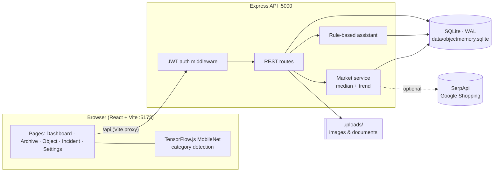
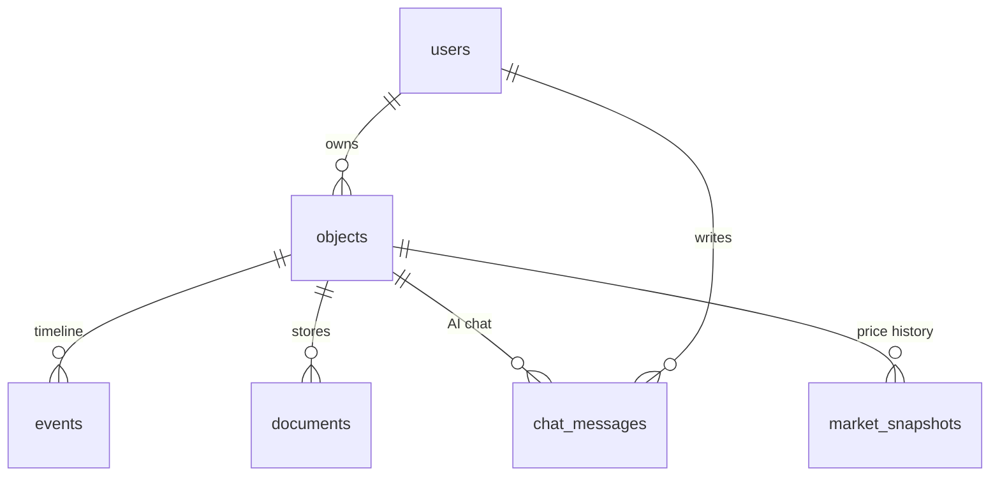

<div align="center">


# ObjectMemory

### Give your possessions a memory.

A full-stack personal archive that tracks the **history, condition, documents, incidents and market value** of everything you own, with an on-device AI assistant that answers from *your* data.

<p>
  
  
  
  
  
  
  
</p>

[Features](#-features) ·
[Quick Start](#-quick-start) ·
[Architecture](#-architecture) ·
[API](#-api-reference) ·
[Market Trends](#-market-trend-tracking) ·
[Roadmap](#-roadmap)

</div>

---

## Why ObjectMemory?

Receipts fade. Warranty cards vanish. Nobody remembers when that scratch appeared on the laptop, and insurers want proof.

**ObjectMemory** turns every object you own into a living record: what it is, when you bought it, what shape it's in, what happened to it, and what it's worth today. Everything is stored **locally** in SQLite. No cloud account, no paid AI key, no data leaving your machine (unless you opt in to market lookups).

---

## Features

| | Feature | Details |
|---|---|---|
| 🗂️ | **Object Archive** | Add, edit, delete and search objects by name, category or subtitle. Fields for brand, model, origin, serial, purchase date, value and warranty. |
| 📷 | **Photo-based category detection** | Upload a photo and **MobileNet v2 (TensorFlow.js)** runs *in the browser* to suggest a category (Car, Computer, Phone, Camera, ...). Nothing is uploaded for inference. |
| 🩺 | **Condition tracking** | Excellent / Good / Fair / Damaged / Needs repair, with automatic timeline events whenever condition changes. |
| 🚨 | **Incident & damage logging** | A dedicated incident flow: pick an object, describe the change, attach a dated photo. AI suggests an observation, and you verify it before saving ("keep the record honest"). |
| 🕰️ | **Memory timeline** | Chronological history per object: creation, condition changes, photos, documents, incidents, notes. Each event supports its own image. |
| 📄 | **Document vault** | Upload receipts, manuals and warranty PDFs (10 MB limit) and open or delete them. Stored on disk with UUID filenames. |
| 💬 | **Ask AI (local)** | Per-object chat answering questions about condition, damage, purchase date, warranty, serial and value. Conversations persist in SQLite. **Deterministic and rule-based, so it never invents facts.** |
| 🧠 | **Archive-wide Q&A** | The dashboard assistant answers across all objects: upcoming warranty expiries, recent damage, new arrivals, what needs attention. |
| 📈 | **Market trend tracking** | Live Google Shopping prices via SerpApi, stored as **dated snapshots**. The trend is computed from real observations, never fabricated. |
| 🔐 | **Authentication** | Register/login, bcrypt-hashed passwords, 7-day JWT sessions, per-user data isolation. |
| 📊 | **Dashboard** | Totals for objects, incidents and documents, plus a recent-activity feed. |

---

## Tech Stack

| Layer | Technology |
|---|---|
| **Frontend** | React, React Router, Vite, lucide-react icons |
| **On-device ML** | `@tensorflow/tfjs` + `@tensorflow-models/mobilenet` (v2, α = 1.0) |
| **Backend** | Node.js, Express, CORS, Multer (file uploads) |
| **Database** | Built-in **`node:sqlite`** (`DatabaseSync`) with WAL mode and foreign keys, so no native build step |
| **Auth** | `jsonwebtoken`, `bcryptjs` |
| **Market data** | SerpApi (Google Shopping), optional |
| **Dev tooling** | `concurrently` runs API and client together |

---

## Architecture



In development, Vite proxies `/api` and `/uploads` to the Express server, so the browser only ever talks to one origin.

### Data model



| Table | Purpose |
|---|---|
| `users` | Accounts (name, email, bcrypt hash) |
| `objects` | The archive: title, brand, model, category, condition, purchase date, value, warranty, serial, origin, image |
| `events` | Timeline entries: `created`, `condition`, `damage`, `incident`, `note`, `photo`, `document` |
| `documents` | Uploaded file metadata (original name, stored name, MIME type, size) |
| `chat_messages` | Persistent per-object AI conversation |
| `market_snapshots` | Dated price observations (`price`, `currency`, `source`, `title`, `url`) indexed by `(object_id, observed_at)` |

Schema creation and lightweight column migrations run automatically on server start.

---

## Quick Start

### Prerequisites

- **Node.js 22.5 or newer** (**22.13+ recommended**). The server uses the built-in `node:sqlite` module, which is not available in Node 18/20.
- npm

### Install & run

```bash
git clone https://github.com/<your-username>/Object_Memory.git
cd Object_Memory

npm install
cp .env.example .env      # then edit .env (see Configuration)
npm run dev
```

| Service | URL |
|---|---|
| Web app | http://localhost:5173 |
| API | http://localhost:5000 |

Prefer two terminals?

```bash
npm run server   # API on :5000
npm run client   # Vite on :5173
```

### Demo account

A demo user is created on first launch:

| Email | Password |
|---|---|
| `demo@objectmemory.local` | `demo123` |

> Change or delete this account before exposing the app to a network.

### Production build

```bash
npm run build     # outputs to dist/
npm start         # starts the API
```

> The Express server serves `/uploads` and the API. Serve the built `dist/` with a static host or reverse proxy of your choice.

---

## Configuration

Copy `.env.example` to `.env`:

| Variable | Default | Description |
|---|---|---|
| `SERPAPI_KEY` | *(empty)* | Enables the Market tab. Get a key at [serpapi.com](https://serpapi.com). |
| `MARKET_GL` | `in` | Google Shopping country code |
| `MARKET_HL` | `en` | Interface language |
| `MARKET_GOOGLE_DOMAIN` | `google.co.in` | Google domain to query |
| `OBJECTMEMORY_JWT_SECRET` | dev fallback | **Set a long random string in any real deployment.** |
| `PORT` | `5000` | API port |

Generate a strong secret:

```bash
node -e "console.log(require('crypto').randomBytes(48).toString('hex'))"
```

`.env` is git-ignored. Never commit real keys.

---

## Market Trend Tracking

Object Detail → **Market** → **Refresh market**.

1. The server builds a query from `brand + model + title + subtitle`.
2. It calls SerpApi's Google Shopping engine.
3. Results are filtered: **new items only** (second-hand listings are dropped), positive prices, and titles that match the brand and every model token.
4. Duplicates (same source and title) are removed, and up to **12 listings** are saved as a timestamped snapshot.
5. Snapshots are grouped per day and reduced to the **daily median**.
6. Trend is derived from first vs. latest daily median:

| Change | Trend |
|---|---|
| > +1% | 📈 Rising |
| < −1% | 📉 Falling |
| within ±1% | ➖ Stable |
| one day of data | Collecting history |

**No fake history.** The first refresh creates the first data point, and a percentage appears once observations exist on at least two different days.

---

## The Local AI Assistant

ObjectMemory deliberately avoids a hosted LLM by default:

- **Per-object chat** matches intent (condition, damage, purchase, warranty, serial, value, documents, timeline) and answers strictly from stored fields.
- **Archive-wide assistant** reasons over all objects: soonest warranty expiries, recent incidents, new arrivals.
- Value answers explicitly state they are *your recorded value*, not a market valuation.
- **Zero cost, fully offline, and no hallucinations.**

The `aiReply()` function in `server/index.js` is a clean integration point if you want to swap in a hosted LLM later.

---

## API Reference

All routes except `/api/auth/register` and `/api/auth/login` require `Authorization: Bearer <token>`.

<details>
<summary><b>Auth</b></summary>

| Method | Endpoint | Description |
|---|---|---|
| `POST` | `/api/auth/register` | Create account (`name`, `email`, `password` ≥ 6 chars) |
| `POST` | `/api/auth/login` | Returns `{ token, user }` |
| `GET` | `/api/auth/me` | Current user |

</details>

<details>
<summary><b>Objects & timeline</b></summary>

| Method | Endpoint | Description |
|---|---|---|
| `GET` | `/api/objects?search=` | List / search objects |
| `POST` | `/api/objects` | Create object |
| `GET` | `/api/objects/:id` | Object with events and documents |
| `PUT` | `/api/objects/:id` | Update (logs an event if condition changes) |
| `DELETE` | `/api/objects/:id` | Delete (cascades) |
| `POST` | `/api/objects/:id/events` | Add timeline event (`note` / `damage` / `incident`) |
| `POST` | `/api/objects/:id/image` | Set object photo |
| `POST` | `/api/objects/:id/events/:eventId/image` | Attach photo to an event |

</details>

<details>
<summary><b>Documents, chat, market, dashboard</b></summary>

| Method | Endpoint | Description |
|---|---|---|
| `POST` | `/api/objects/:id/documents` | Upload a document (multipart, ≤ 10 MB) |
| `DELETE` | `/api/documents/:id` | Delete a document |
| `GET` / `POST` | `/api/objects/:id/chat` | Read / send chat messages |
| `GET` | `/api/objects/:id/market?refresh=1` | Market summary (`refresh=1` fetches a new snapshot) |
| `GET` | `/api/dashboard` | Stats and recent activity |

</details>

---

## Project Structure

```text
Object_Memory/
├── server/
│   └── index.js          # Express API, SQLite schema, auth, market service, AI replies
├── src/
│   ├── main.jsx          # React app: routes, pages, components, vision helper
│   └── styles.css        # Editorial "archive" theme (Libre Baskerville + DM Mono)
├── data/                 # SQLite database (auto-created, git-ignored)
├── uploads/              # Uploaded images & documents (git-ignored)
├── index.html
├── vite.config.js        # Dev proxy for /api and /uploads
├── .env.example
└── package.json
```

### Routes

| Path | Page |
|---|---|
| `/login` | Sign in / register |
| `/` | Dashboard |
| `/archive` | Searchable archive |
| `/objects/new` | Add object (with photo detection) |
| `/objects/:id` | Detail: Overview · Timeline · Documents · Market · Ask AI |
| `/incident` | Report damage or change |
| `/settings` | Account & logout |

---

## Security Notes

- Passwords are hashed with **bcrypt**, and sessions are signed **JWTs** (7-day expiry).
- Every query is scoped to `user_id`, so users cannot read each other's objects.
- Uploads are stored under random UUID names, with a 10 MB cap. Image endpoints reject non-image MIME types.
- Before deploying publicly: set a strong `OBJECTMEMORY_JWT_SECRET`, remove the demo user, restrict CORS to your origin, and serve over HTTPS.

---

## Resetting the Database

Stop the server, then delete `data/objectmemory.sqlite*` and restart. Schema and the demo user are recreated automatically.

---

## Roadmap

- [ ] Optional hosted-LLM adapter behind the existing `aiReply()` hook
- [ ] Export archive as PDF or CSV (insurance-ready report)
- [ ] Warranty-expiry reminders and notifications
- [ ] Multi-currency market data
- [ ] Docker image and one-command deploy
- [ ] Automated tests (API and UI)
- [ ] Split `main.jsx` into modules

---

## Contributing

Contributions are welcome.

1. Fork the repo
2. Create a branch: `git checkout -b feature/amazing-idea`
3. Commit and push
4. Open a Pull Request

---

## License

Released under the **MIT License**. See `LICENSE` for details.

<div align="center">

**ObjectMemory**: because everything you own has a story.

</div>